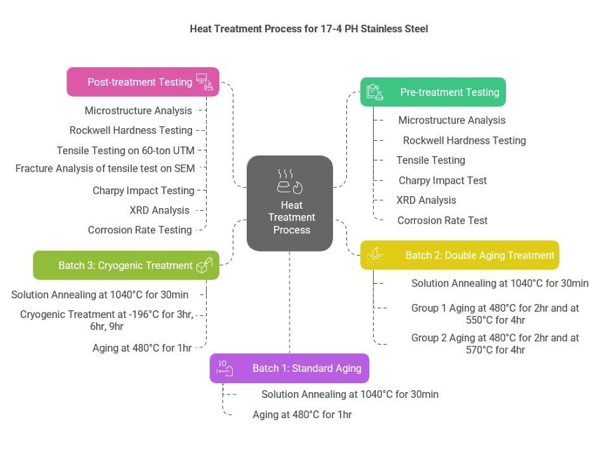
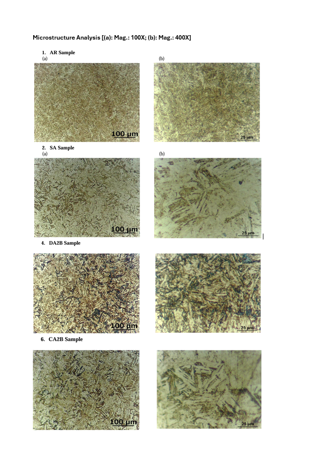
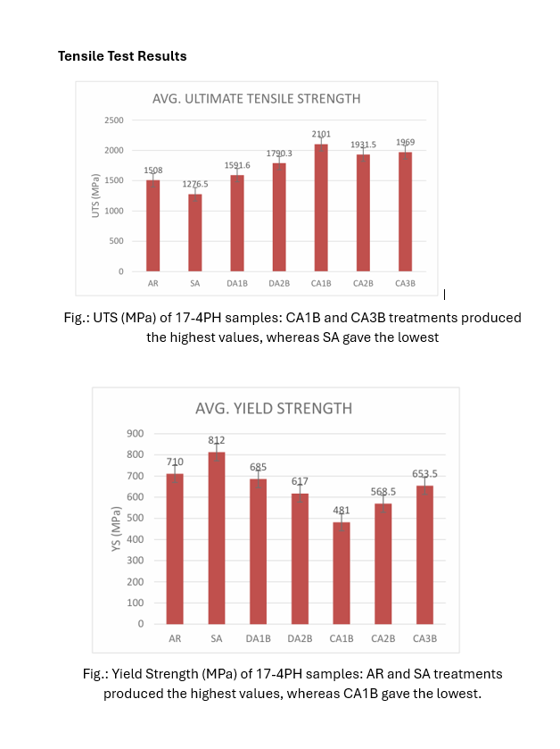
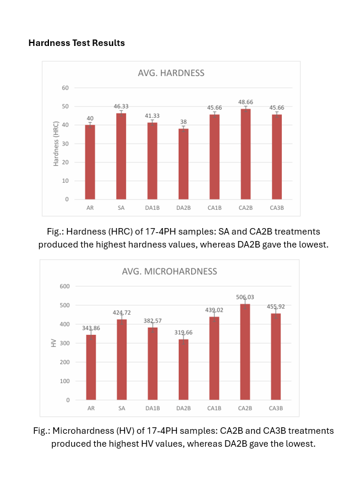
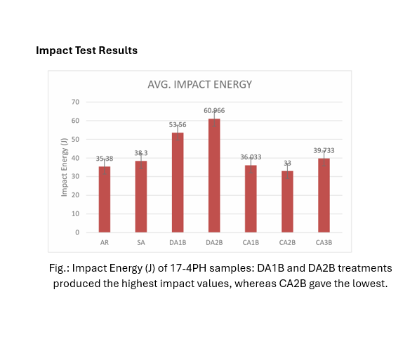
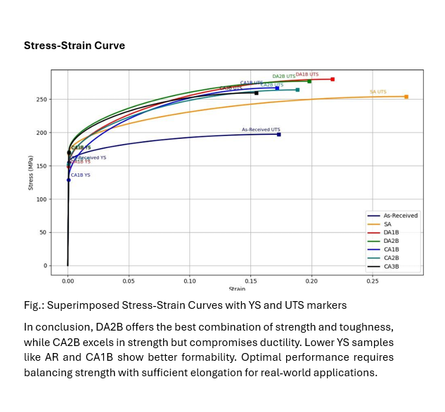
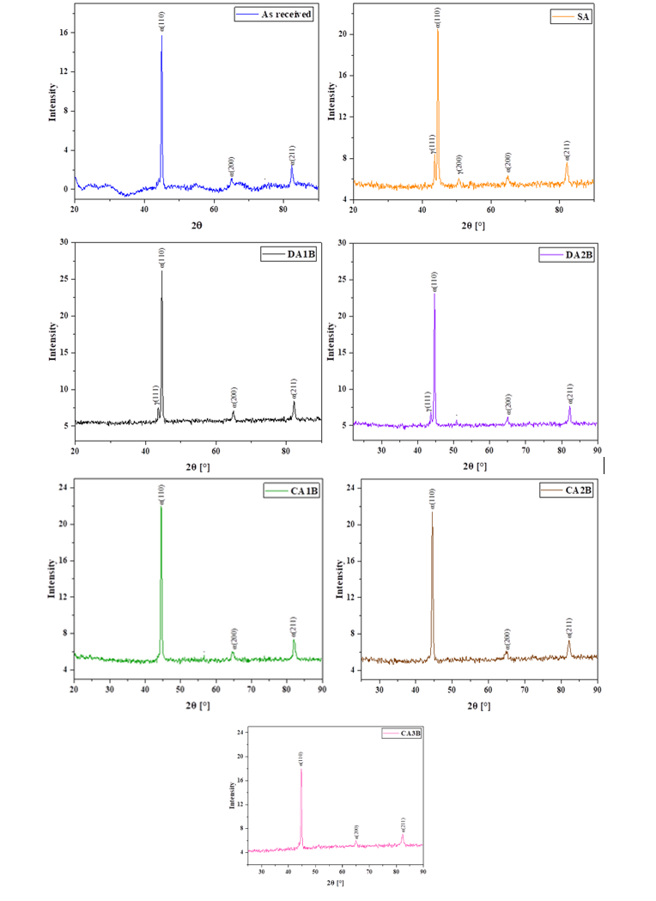
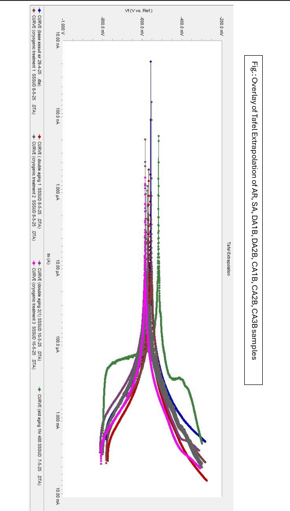
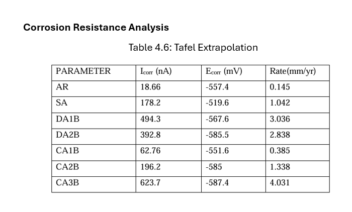

# Optimization of Cryogenic Treatment and Aging Parameters for 17-4 PH Stainless Steel

## Overview

This project investigated the effect of **standard aging, double aging, and cryogenic treatment followed by aging** on the microstructure and performance of 17-4 PH precipitation-hardening stainless steel.

The objective was to establish **processing–structure–property relationships** and evaluate how different heat-treatment schedules influence strength, hardness, ductility, toughness, and corrosion behavior.

**Project:** B.Tech Major Project  
**Institution:** COEP Technological University  
**Year:** 2025

---

## Research Problem

The mechanical performance of 17-4 PH stainless steel is highly dependent on its heat-treatment history. Increasing strength and hardness can introduce trade-offs with ductility, toughness, and corrosion resistance.

This project evaluated whether **cryogenic treatment and modified aging schedules** could be used to tailor these properties for different engineering requirements.

---

## Experimental Approach

A commercially available 17-4 PH stainless-steel bar was used as the starting material. The bar had a diameter of **12 mm**.

Seven material conditions were investigated:

- As Received (AR)
- Standard Aging (SA)
- Double Aging 1 (DA1B)
- Double Aging 2 (DA2B)
- Cryogenic Aging 1 (CA1B)
- Cryogenic Aging 2 (CA2B)
- Cryogenic Aging 3 (CA3B)

The baseline solution treatment was performed at **1040 °C for 30 minutes**, followed by air cooling. Aging schedules and cryogenic treatment durations were varied to evaluate their effect on material performance.

Cryogenic treatment was performed using **liquid nitrogen at −196 °C**.

---

## Heat-Treatment Process



The experimental matrix combined solution treatment, aging, double aging, and cryogenic treatment to produce different microstructural states.

---

## Characterization

The heat-treated samples were evaluated using multiple characterization techniques.

### Mechanical Characterization

- Rockwell C hardness
- Vickers microhardness
- Tensile testing
- Yield strength
- Ultimate tensile strength
- Percentage elongation
- Charpy impact toughness

### Structural & Microstructural Characterization

- Optical microscopy
- Scanning Electron Microscopy (SEM)
- X-ray Diffraction (XRD)
- Fractography

### Corrosion Characterization

- Potentiodynamic polarization
- Tafel extrapolation
- Corrosion current density
- Corrosion rate

Three specimens were evaluated for each heat-treatment condition during tensile and impact testing to improve repeatability.

---

# Results

## Microstructure



The heat-treatment schedules produced distinct martensitic morphologies.

The as-received material exhibited predominantly lath martensite. Standard and double aging modified the lath morphology, while cryogenic treatment promoted a refined martensitic structure with reduced retained austenite.

The CA2B condition exhibited a particularly fine and uniformly spaced martensitic lath structure.

---

## Tensile Properties



The tensile response varied substantially with heat-treatment condition.

| Condition | Yield Strength (MPa) | Ultimate Tensile Strength (MPa) |
|-----------|----------------------:|--------------------------------:|
| AR | 710 | 1508 |
| SA | 812 | 1276.5 |
| DA1B | 685 | 1591.6 |
| DA2B | 617 | 1790.3 |
| CA1B | 481 | **2101** |
| CA2B | 568.5 | 1931.5 |
| CA3B | 653.5 | 1969 |

The **SA condition produced the highest measured yield strength (812 MPa)**, while **CA1B exhibited the highest ultimate tensile strength (2101 MPa)**.

---

## Hardness



Cryogenic treatment produced a substantial increase in hardness for selected conditions.

The **CA2B condition exhibited the highest measured hardness at 48.66 HRC**, corresponding to a microhardness of approximately **506 HV**.

---

## Impact Toughness



The double-aging conditions showed the highest measured Charpy impact energies.

**DA2B exhibited the highest impact energy of 60.97 J**, indicating improved impact toughness relative to the other investigated conditions.

---

## Ductility

The measured elongation values were:

| Condition | Elongation (%) |
|-----------|---------------:|
| AR | 17.30 |
| SA | 17.04 |
| DA1B | 19.00 |
| DA2B | **19.80** |
| CA1B | 17.16 |
| CA2B | 18.84 |
| CA3B | 15.45 |

The **DA2B condition exhibited the highest measured elongation at 19.80%**.



---

## X-Ray Diffraction



XRD was used to evaluate phase constitution and changes associated with the different treatment conditions.

The as-received material exhibited characteristic peaks associated with the BCC/martensitic structure, with prominent reflections near approximately **44°, 65°, and 82° 2θ**.

---

## Corrosion Behavior



Corrosion behavior was evaluated using potentiodynamic polarization and Tafel extrapolation in **3.5 wt% NaCl**.

| Condition | Corrosion Rate (mm/year) |
|-----------|-------------------------:|
| AR | **0.145** |
| SA | 1.042 |
| DA1B | 3.036 |
| DA2B | 2.838 |
| CA1B | 0.385 |
| CA2B | 1.338 |
| CA3B | **4.031** |

The as-received condition exhibited the **lowest measured corrosion rate**, while CA3B exhibited the highest.



---

# Processing–Structure–Property Relationship

The experimental results demonstrate how processing history influences microstructure and, consequently, material properties.

**Standard aging** promoted precipitation and produced a high-strength, high-hardness condition.

**Double aging** produced more tempered and coarsened lath structures and resulted in improved ductility and impact toughness.

**Cryogenic treatment** promoted transformation of retained austenite and refinement of the martensitic structure. Among the cryogenic conditions, CA2B exhibited a particularly refined and uniformly spaced martensitic morphology and the highest hardness.

Overall, the results demonstrate that **strength, hardness, ductility, toughness, and corrosion resistance cannot be simultaneously maximized through a single treatment schedule**.

---

# Engineering Implications

The results suggest different treatment conditions depending on the dominant engineering requirement:

| Requirement | Condition |
|-------------|-----------|
| Highest yield strength | **SA** |
| Highest ultimate tensile strength | **CA1B** |
| Highest hardness | **CA2B** |
| Highest elongation | **DA2B** |
| Highest impact toughness | **DA2B** |
| Lowest measured corrosion rate | **AR** |

This highlights the importance of selecting heat-treatment parameters according to the **specific application and required property balance**, rather than optimizing a single material property in isolation.

---

# Skills & Techniques

### Materials Engineering

- Heat-treatment design
- Cryogenic processing
- Precipitation hardening
- Metallography
- Processing–structure–property analysis

### Materials Characterization

- XRD
- SEM
- Optical microscopy
- Rockwell hardness
- Vickers microhardness
- Tensile testing
- Charpy impact testing
- Potentiodynamic polarization
- Tafel extrapolation

### Engineering Analysis

- Experimental design and comparison
- Property optimization
- Materials performance evaluation
- Processing–structure–property correlation

---

# Repository Contents

```text
17-4PH-Stainless-Steel-Heat-Treatment/
│
├── README.md
│
├── data/
│
├── analysis/
│
├── figures/
│   ├── heat_treatment_process.jpeg
│   ├── microstructure_comparison.png
│   ├── tensile_properties.png
│   ├── hardness_results.png
│   ├── impact_energy.png
│   ├── stress_strain_analysis.png
│   ├── xrd_analysis.png
│   ├── corrosion_rate.png
│   └── corrosion_tafel_data.png
│
└── results/
